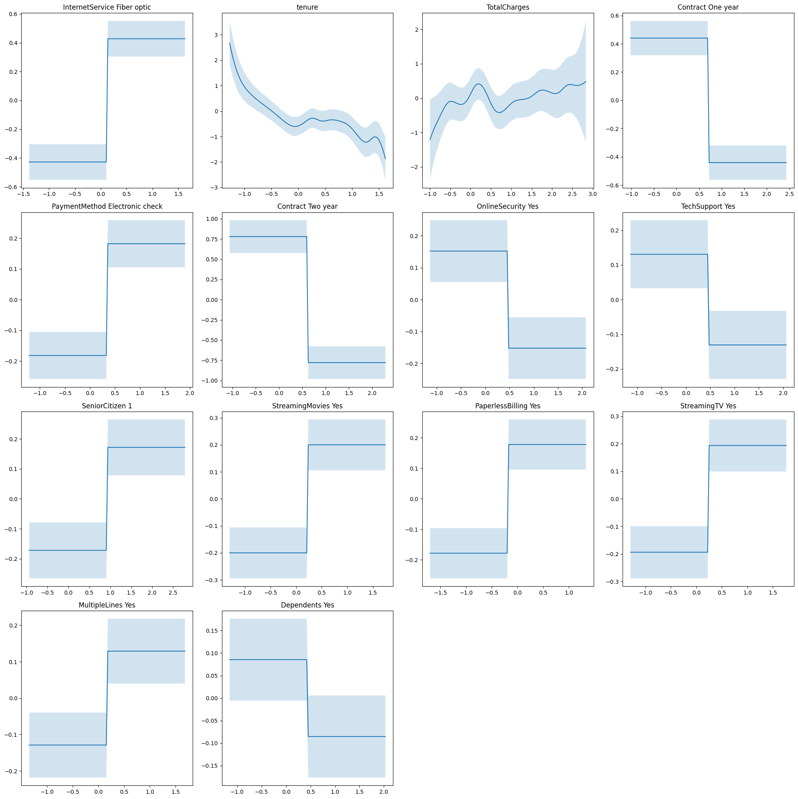

# XAI_HW2

This repository contains a notebook which will utilize a kaggle telecomunications data set to evaluate the performance of linear regression, logistic regression, and GAMs for the prediction of customer churn. The notebook can be accessed via colab notebooks by clicking the link embedded within.

Evaluation will be conducted both on the accuracy of these models in predicting churn (a historically difficult thing to do) but also the relative interpretability of each of these models. The final model, Generalized Additive Models (GAMs) are particularly interesting for their ability to generate feature partial dependence plot (shown below) where one can see the relationship between a feature and the target variable while holding all other features constant.

GAM Partial Dependence Output:

